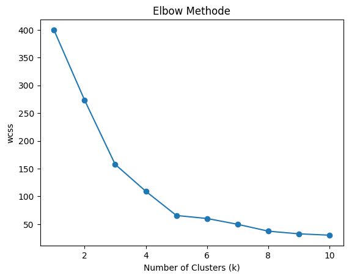
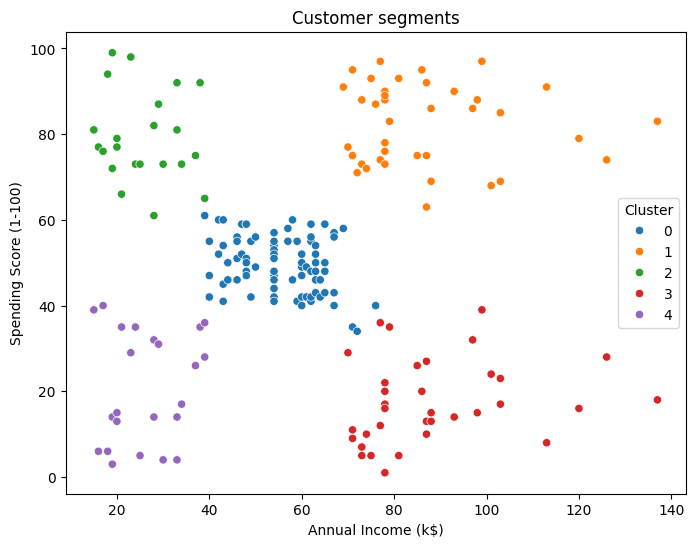
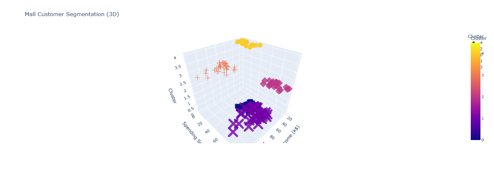

## 🛍️ Mall Customer Segmentation using K-Means

### 📌 Project Overview

This project segments mall customers based on their annual income and spending behavior using K-Means clustering. The goal is to identify customer groups that can help businesses design targeted marketing strategies and improve customer engagement.

### 📊 Dataset

Source: Mall Customers Dataset
Features Used:

Annual Income (k$)

Spending Score (1–100)

### ⚙️ Technologies Used

- Python

- Pandas, NumPy

- Scikit-learn

- Matplotlib, Seaborn

- Plotly

### 📈 Elbow Method (Choosing Optimal Clusters)



The curve bends at k = 5, indicating an ideal balance between compactness and simplicity.

### 📊 Customer Segmentation (2D Visualization)




Customers are grouped into five clusters based on income and spending behavior. Each cluster represents a unique customer segment.

### 🌀 3D Cluster Visualization



A 3D visualization provides a deeper view of how clusters are distributed and validates separation between customer groups.

### 📐 Model Evaluation

Silhouette Score: ~0.55
This indicates good cluster separation and meaningful segmentation.

### 💡 Business Insights

- High Income + High Spending: Premium loyal customers

- High Income + Low Spending: Upselling opportunity

- Low Income + High Spending: Discount-driven customers

- Low Income + Low Spending: Low-value segment

- Average Group: Regular customers

### Folder Structure
```
customer-segmentation/
│
├── notebook.ipynb
├── images/
│   ├── elbow.png
│   ├── clusters_2d.png
│   └── clusters_3d.png
├── README.md
```

### ✅ Conclusion

K-Means clustering successfully identified meaningful customer segments that can help businesses optimize marketing strategies and improve decision-making.
